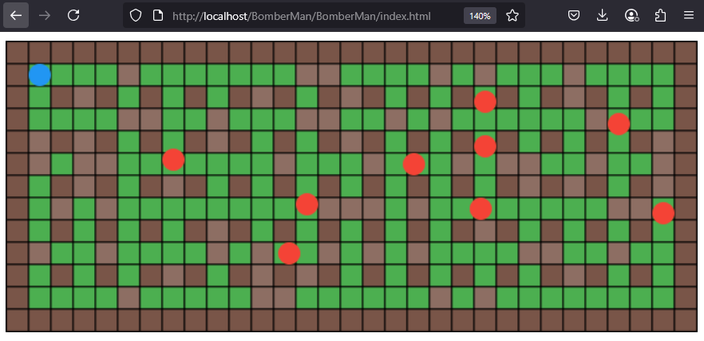
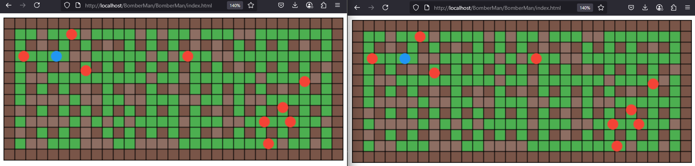

# BomberMan
2D Online Game made with: PHP + TypeScript + Canvas. Using on WebSockets for communication!




## Quick set up
Server
```bash
cd server
php server.php
```

Client
```bach
cd client
npm i
npx tsc
```

! Don't forget to change the path to adjust proper path to generated /dist/main.js script
